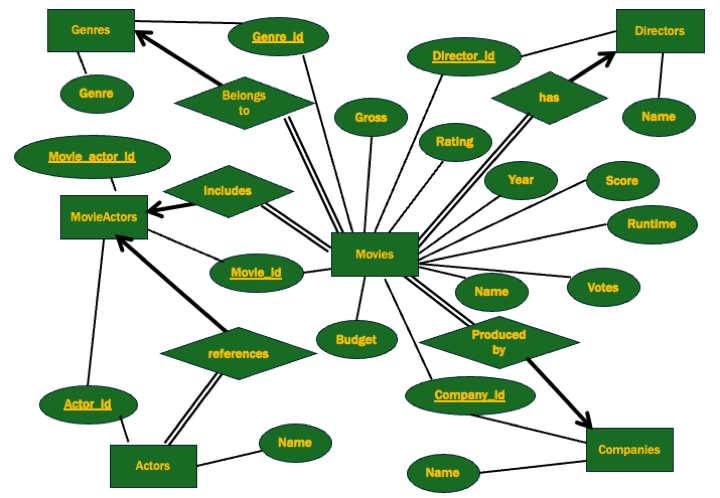

# Movie Management Database System

This project focuses on the design and implementation of a **relational database system** for managing and analyzing movie data. Using **SQL** and **Python**, this project demonstrates how structured storage and query logic can uncover meaningful insights from a complex dataset.

## My Contributions

- Contributed to writing SQL queries for data retrieval and filtering  
- Created Python visualizations showing score distributions, yearly gross trends, and budget vs. revenue patterns

## Dataset

The dataset was sourced from Kaggle and includes attributes such as:
- Movie title
- Genre
- Release year
- Director and actors
- Budget and gross revenue
- IMDB scores

## ER Diagram

The database schema consists of six normalized tables connected via foreign keys.



## SQL Query Examples

```sql
-- 1. Count number of movies by director
SELECT Director, COUNT(*) AS num_movies
FROM Movies
GROUP BY Director
ORDER BY num_movies DESC;

-- 2. Average rating and total gross revenue by genre
SELECT G.Genre, AVG(M.Score) AS avg_score, SUM(M.Gross) AS total_gross
FROM Movies M
JOIN Genres G ON M.Genre_ID = G.Genre_ID
GROUP BY G.Genre
ORDER BY total_gross DESC;

-- 3. Top movies after 2015 with revenue over $100M
SELECT Title, Gross, Year
FROM Movies
WHERE Year > 2015 AND Gross > 100000000
ORDER BY Gross DESC;

-- 4. WITH clause: Top movie per year based on gross revenue
WITH YearlyTopMovies AS (
  SELECT Title, Year, Gross,
         RANK() OVER (PARTITION BY Year ORDER BY Gross DESC) AS rank
  FROM Movies
)
SELECT * FROM YearlyTopMovies
WHERE rank = 1;
```

## Visualizations

The following visualizations were created using Python.

### 1. Distribution of Movie Scores


---

### 2. Total Gross and Average Score by Year


---

### 3. Gross Revenue vs Budget (Colored by Score)


## Tools Used

- SQL
- Python (for visualization)
- DB Browser

